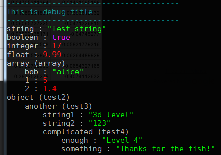
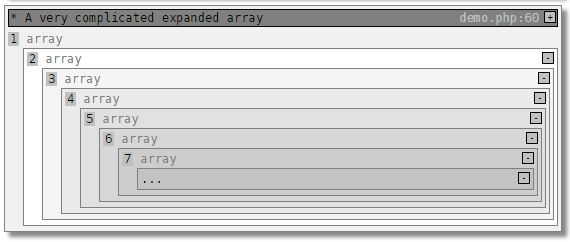
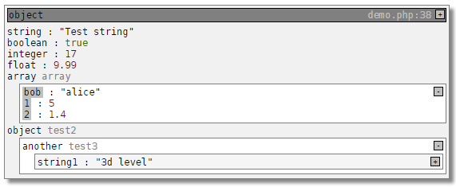
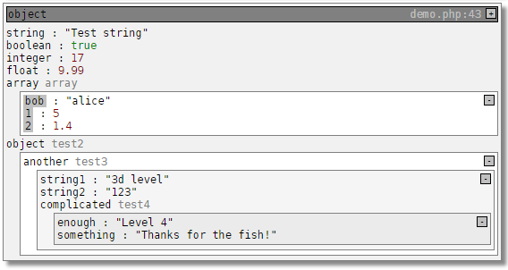
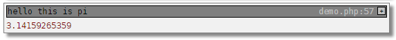
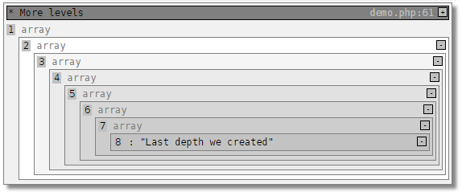
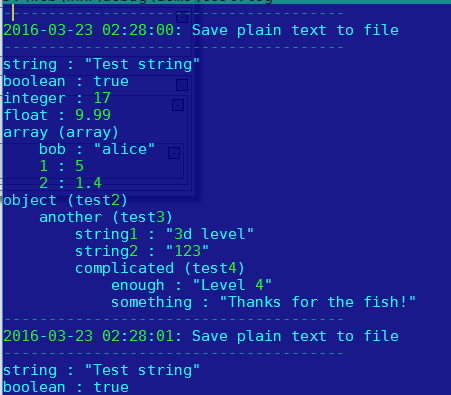

function debug ($object)
================

function debug (mixed $object, string/boolean $title=null, boolean/string $plain=false, integer $limit=6)

**debug** is a single function for visually analything / logging complex deep level objects and arrays.

Example of debug call html output:


Example of cli mode output



Or



Let us have an example classes (check ./demo/demo.php)
```php
	class test1
	{
		public $string = "Test string";
		public $boolean = true;
		public $integer = 17;
		public $float = 9.99;
		public $array = array ('bob'=>'alice',true=>false,1=>5,2=>1.4);
		public $object;
	}

	class test2
	{
		public $another;
	}

	class test3
	{
		public $string1 = "3d level";
		public $string2 = "123";
		public $complicated;
	}

	class test4
	{
		public $enough = "Level 4";
		public $something = "Thanks for the fish!";
	}
```

And intialize them in a following manner:
```php
	$test = new test1 ();
	$test->object = new test2();
	$test->object->another = new test3 ();
	$test->object->another->complicated = new test4 ();
```

Now let us start debugging **$test1**. A simpliest call:
```php
	debug ($test);
```
Will output following:



Note that object of class *test3* is collapsed and only first property is visible you can unfold it by clicking + or you can just debug object with everything expanded by calling:

```php
	debug ($test, true);
```
So now we see hidden parts of our object by default



Putting title on debug:
```php
	$pi = 3.14159265359;
	debug ($pi, "hello this is pi");
```



To have both expanded and titled debug we should just put * symbol in the begining of title string like this:
```php
	$hm = array (1=>array(2=>array(3=>array(4=>array(5=>array(6=>array(7=>array(8=>"Last depth we created"))))))));
	debug ($hm, "* A very complicated expanded array");
```


On a depth level 6 (considering starting level is 0) only ... is visible because of depth rendering limit which is by default 6. To unlock other levels we should incrase limit.

```php
debug ($hm, "* More levels", false, 10);
```



Third parameter is for plain text output if you pass *true*
```php
debug ($test, "Output something as plain text", true);
```
It will output something like following indented with 4 space tabs:

```php
Output something as plain text
-------------------
string : "Test string"
boolean : true
integer : 17
float : 9.99
array (array)
    bob : "alice"
    1 : 5
    2 : 1.4
object (test2)
    another (test3)
        string1 : "3d level"
        string2 : "123"
        complicated (test4)
            enough : "Level 4"

```

To log plain text output in file just pass file path as a third parameter
```php
debug ($test, date('Y-m-d H:i:s').": Save plain text to file ", "./test.log");
```



And lastly if you are using subl-protocol plugin for sublime (https://github.com/thecotne/subl-protocol) you can unfold debug backtrace and with one click in browser jump on the specific file and line in sublime text editor:


To debug in error log use 'error_log' in 3d parameter:
````PHP
	debug ($_GET,'GET','error_log');
````
To view error log nicely formated use:
````
tail -f error_log | grep --line-buffered "\n--" | sed "s/\\\n/\\n/g"
````
Or if you want all other error log messages:
````
tail -f error_log | sed "s/\\\n/\\n/g"
````