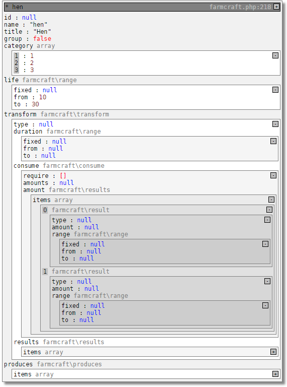

function debug ($object, $title=null, $plain=false, $limit=6, $level=0)
================
**debug** is a function for visually analything / loggin complex php user defined data structures like deep level objects and arrays:

Example of debug call html output:

